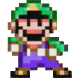
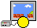

# 
  **Lets'a Hang**  

### 
 A Mario themed Hangman. 

### _Contributor(s) and Contact Info_ 

| Name            | Email               | GitHub  |
|---	            |---	                |---	    |
| Tien Nguyen	    |  tien96ng@gmail.com | [GitHub](https://github.com/Tien96ng) |
| Connor Burgess  |   	                | [GitHub](https://github.com/ConnorBurgess)  	|
| Logan Roth	    | logan.roth.g@gmail.com |  [GitHub(Lo-GR)](https://github.com/Lo-GR) 	|
| Michael Kriegel | mikkrieg@gmail 	    | [Github](https://github.com/mikkrieg)	|

---

## _Technologies Used_ 

* **JavaScript**
* **JSX**
* **ReactJs**
* **Redux**
* **Material UI**
* **NPM**
* **ESLint**
* **Babel**
* **FontAwesome**

---

## _Description_ 📃
A Mario themed hangman. It contains various elements that are relevant to Mario by Nintendo (Words, color, pictures/animations, and background). State management is handled by React and Redux. 

---

## _Preview_ 

> [PLACEHOLDER] Insert a Gif of the Game  
> [PLACEHOLDER] Insert Live Link  

---

## _Installation Guide_ 

Open for full Guide

### _Cloning and Initial Setup_

> Repository: https://github.com/Tien96ng/redux-hangman
1. You will need to use your system's **terminal emulator** to setup and locally use this application.
2. This project uses npm as a package manager, you can download it [here](https://www.npmjs.com/get-npm).
3. To clone this directory, navigate in your terminal to the desired location of the project and run command `https://github.com/Tien96ng/redux-hangman`
4. Navigate to top level of the directory with command `cd tap-room`
5. To install dependencies into the project run command `npm install`
6. To launch this project in a browser, run command `npm start`
7. To exit live server, press Ctrl+C in your terminal

---

## _Full Guide to Run React App_ 📓 

 Open for full Guide 

## Getting Started with Create React App 

This project was bootstrapped with [Create React App](https://github.com/facebook/create-react-app).

## Available Scripts

In the project directory, you can run:

### `npm start`

Runs the app in the development mode.\
Open [http://localhost:3000](http://localhost:3000) to view it in the browser.

The page will reload if you make edits.\
You will also see any lint errors in the console.

### `npm test`

Launches the test runner in the interactive watch mode.\
See the section about [running tests](https://facebook.github.io/create-react-app/docs/running-tests) for more information.

### `npm run build`

Builds the app for production to the `build` folder.\
It correctly bundles React in production mode and optimizes the build for the best performance.

The build is minified and the filenames include the hashes.\
Your app is ready to be deployed!

See the section about [deployment](https://facebook.github.io/create-react-app/docs/deployment) for more information.

### `npm run eject`

**Note: this is a one-way operation. Once you `eject`, you can’t go back!**

If you aren’t satisfied with the build tool and configuration choices, you can `eject` at any time. This command will remove the single build dependency from your project.

Instead, it will copy all the configuration files and the transitive dependencies (webpack, Babel, ESLint, etc) right into your project so you have full control over them. All of the commands except `eject` will still work, but they will point to the copied scripts so you can tweak them. At this point you’re on your own.

You don’t have to ever use `eject`. The curated feature set is suitable for small and middle deployments, and you shouldn’t feel obligated to use this feature. However we understand that this tool wouldn’t be useful if you couldn’t customize it when you are ready for it.

## Learn More

You can learn more in the [Create React App documentation](https://facebook.github.io/create-react-app/docs/getting-started).

To learn React, check out the [React documentation](https://reactjs.org/).

### Code Splitting

This section has moved here: [https://facebook.github.io/create-react-app/docs/code-splitting](https://facebook.github.io/create-react-app/docs/code-splitting)

### Analyzing the Bundle Size

This section has moved here: [https://facebook.github.io/create-react-app/docs/analyzing-the-bundle-size](https://facebook.github.io/create-react-app/docs/analyzing-the-bundle-size)

### Making a Progressive Web App

This section has moved here: [https://facebook.github.io/create-react-app/docs/making-a-progressive-web-app](https://facebook.github.io/create-react-app/docs/making-a-progressive-web-app)

### Advanced Configuration

This section has moved here: [https://facebook.github.io/create-react-app/docs/advanced-configuration](https://facebook.github.io/create-react-app/docs/advanced-configuration)

### Deployment

This section has moved here: [https://facebook.github.io/create-react-app/docs/deployment](https://facebook.github.io/create-react-app/docs/deployment)

### `npm run build` fails to minify

This section has moved here: [https://facebook.github.io/create-react-app/docs/troubleshooting#npm-run-build-fails-to-minify](https://facebook.github.io/create-react-app/docs/troubleshooting#npm-run-build-fails-to-minify)

---

## _Known Bugs_ 🩹
* 

---

## _Future Updates_ 
* 

---

## _License_ ⚖️

Copyright (c) 2021 Tien Nguyen, Logan Roth, Connor Burgess, Michael Kriegel.

Please contact Contributor for further use information or if you would like to make a contribution.